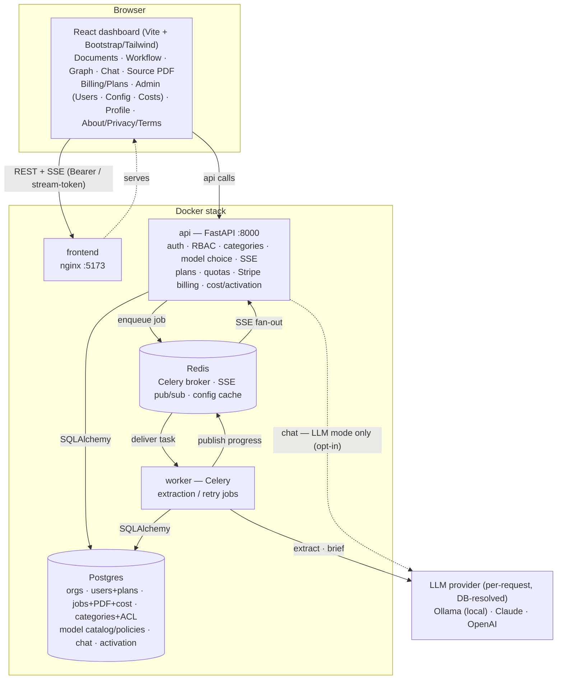
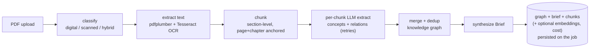
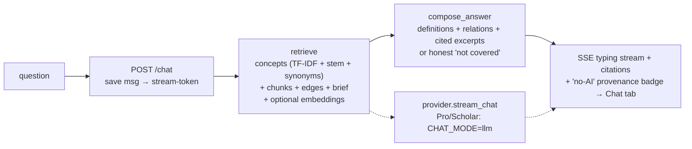
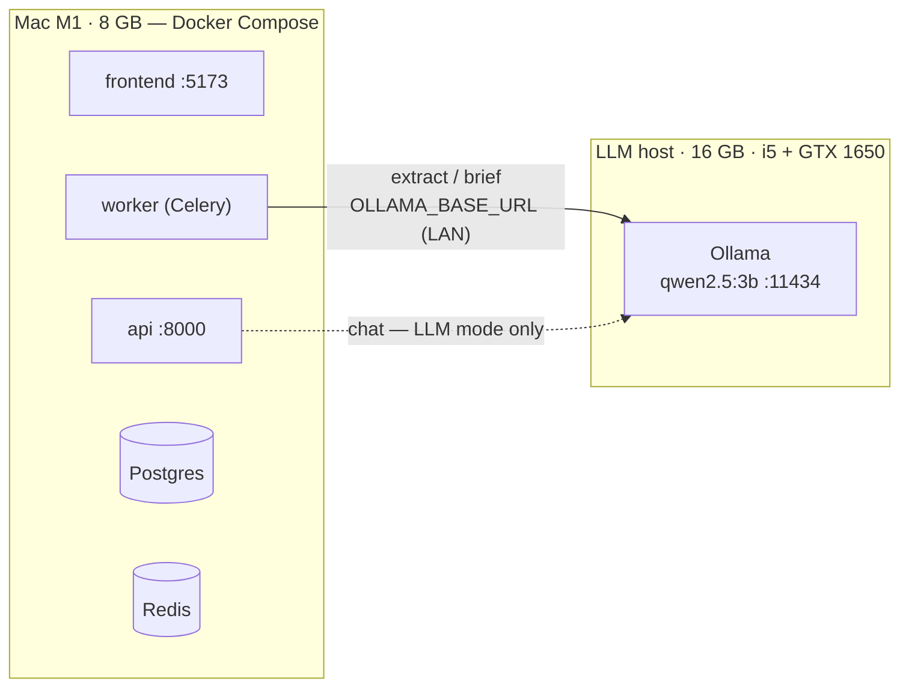

# KnowledgeBook — Document Knowledge Graph

Turn a long technical document (e.g. a 350-page PDF like *The Pragmatic
Programmer*) into a **navigable knowledge graph** of concepts and relationships,
so a reader can understand the book fast without reading it end to end.

> Not summarization — a *semantic map*. The goal: state the thesis in one
> sentence, name the 5–10 core concepts, see how they connect, and know which
> chapter to jump to for any of them.

---

## Why

A 300-page book holds ~15–20 genuinely novel ideas buried in hundreds of pages of
elaboration. Reading it all is slow; skimming misses nuance. KnowledgeBook
ingests the PDF (digital **or scanned** — OCR built in), extracts concepts and
their relationships with an LLM, and produces four outputs: a **Brief**, a
**Concept Map**, a **Chapter Guide**, and grounded **Q&A**.

---

## Architecture

The stack is a **React dashboard**, a **FastAPI** API, a **Celery worker** (durable
extraction jobs), **Postgres**, and **Redis** (Celery broker + cross-replica SSE
pub/sub + config cache), plus a pluggable **LLM provider** (local Ollama by
default; Claude/OpenAI) used for **extraction**. **Chat answers are composed from
the extracted graph + persisted chunks with no query-time LLM by default**
(`CHAT_MODE=retrieval`): TF-IDF + stemming + a synonym lexicon, optional
**semantic embeddings**, verbatim cited excerpts, an honest "not covered", and a
ChatGPT-style typing stream. A generative LLM answer is a per-plan upgrade
(`CHAT_MODE=llm`, gated to Pro/Scholar). Auth is JWT (in-memory access token +
HttpOnly refresh cookie) with **RBAC** (admin / analyst / viewer), **multi-tenant**
org scoping, **per-category access control**, and **consumer subscription plans**
(Free / Pro / Scholar) with monthly quotas and **Stripe** billing.



**Ingestion pipeline** (background job, streamed live over SSE):



**Chat** (grounded on the stored graph; **no query-time LLM by default**):



> **Retrieval mode (default, zero-LLM):** answers are composed deterministically
> from the extracted concepts, definitions, relationships, cited **verbatim
> excerpts** (from persisted chunks), and the brief — with **TF-IDF ranking +
> stemming + a synonym lexicon**, an optional **semantic-embedding** layer
> (`EMBEDDING_MODEL`), anaphoric **follow-ups** ("tell me more about it"), and an
> honest "not covered" when nothing matches. Instant, zero per-question cost,
> available to **all roles/plans** (read-only, per-document ACL). **Value ladder
> (`CHAT_MODE=llm`):** Free plans get retrieval chat; Pro/Scholar get generative
> LLM answers (gated by `CHAT_LLM_MIN_PLAN`; admins bypass; set `free` on-prem).
> See [`docs/feature-tracking-retrieval-chat.md`](docs/feature-tracking-retrieval-chat.md).

---

## Features (implemented)

- **Ingestion** — upload a PDF (digital **or scanned**, Tesseract OCR fallback) →
  concept/relationship **knowledge graph** with source citations + confidence, and
  a synthesized **Brief**. Runs as a **durable Celery job** (survives restarts).
- **Live workflow** — watch each stage stream over SSE (survives page refresh);
  **retry** just the failed chunks and merge them back in.
- **Explore** — interactive concept **graph**, **Brief**, **Chat** with the
  document, and a **Source-PDF viewer** with zoom + page nav to compare answers
  against the original.
- **Grounded chat (zero-LLM by default)** — retrieval over the graph + persisted
  chunks: **TF-IDF ranking + stemming + synonyms**, optional **semantic
  embeddings**, **verbatim cited excerpts**, anaphoric **follow-ups**, an honest
  **"not covered"**, and a **ChatGPT-style typing stream**. Each answer shows a
  **provenance badge** ("Answered from the document · no AI" vs "AI-generated").
  Generative LLM chat is a **Pro/Scholar** upgrade.
- **Choose your model, per request** — free local `qwen2.5:3b` by default; pick a
  premium model (Claude / GPT-4o) for extraction (and chat in LLM mode).
  Config-as-data (DB-resolved, **no restart**).
- **Accounts & access** — login/logout (JWT + refresh), **RBAC** (admin/analyst/
  viewer), **multi-tenant** orgs, and **categories** with per-category
  view/upload/manage **ACLs** (default-deny). Roles are enforced end-to-end: only
  **admin/analyst** upload; only the **owner or admin** deletes; **all roles** can
  view and chat documents they've been granted. Admin console for users +
  categories, plus a per-user **profile** page (model preferences, sign out)
  reached from an **avatar dropdown** (view profile / logout).
- **App shell** — top navigation + a site **footer** (also shown on the login
  page) linking **public** **About**, **Privacy**, and **Terms & Conditions**
  pages (reachable without signing in; legal copy is a placeholder to be reviewed
  by counsel). Destructive actions (delete document/category) require an on-theme
  **confirmation dialog**.
- **Plans & billing** — consumer **subscription tiers** (Free / Pro / Scholar)
  with env-tunable **monthly upload quotas** (2 / 20 / 60), Free-tier fences
  (digital-only, 10-concept cap, retrieval-only chat), a **usage meter**, and
  **Stripe** checkout + billing portal + signature-verified webhooks (config-gated;
  the app runs fine without Stripe). See
  [`docs/monetization-pricing.md`](docs/monetization-pricing.md) and
  [`docs/STRIPE-setup.md`](docs/STRIPE-setup.md).
- **Cost controls & activation** — a per-document **LLM cost ledger** with a hard
  **cost cap** (`MAX_DOC_COST_USD`, aborts a job before overrun), an admin **cost
  dashboard** (`/admin/costs`), and **activation instrumentation** (Concept-Map
  view + thumbs rating + co-session Q&A) feeding an admin activation-rate summary.
- **Ops** — Postgres + Redis + Celery worker; per-user **rate limiting**.

See [`docs/ENTERPRISE-productization.md`](docs/ENTERPRISE-productization.md) for the
full enterprise roadmap (SSO, billing, audit, SOC 2, …) and what's still ahead.

---

## Repository layout

| Path | What it is |
|---|---|
| `docs/` | Product + engineering docs, each paired with a self-contained `*.ctx.md` AI digest |
| `extraction-service/` | The Dockerized ingestion → knowledge-graph service + HTTP API (runnable) |
| `frontend/` | React (Vite) **live workflow dashboard** — upload a PDF, watch each stage run, explore the graph |
| `spike/` | Week-1 PDF-parsing + OCR de-risking harness (reproducible) |
| `data/` | Input PDFs (local; not committed) |

### Documents (`docs/`)
The planning chain, each as `*.md` + `*.ctx.md` (read the `.ctx.md` alone if you
are another agent — it's self-contained):

| Doc | Purpose |
|---|---|
| `PRD-knowledge-graph-mvp.md` | Product requirements — scope (OCR is a Phase-1 must), the 4 outputs, acceptance criteria, success metrics |
| `SPIKE-week1-pdf-ocr.md` | Plan to retire the OCR/parser risk before building |
| `SPIKE-week1-findings.md` | Spike results so far (digital path measured on D1) |
| `ARCHITECTURE-mvp.md` | System design — async pipeline, data model, ADRs |
| `PLAN-phase1-implementation.md` | ~11-week, 2-engineer sprint plan with gates |
| `01-product-spec.md` | Auth + UI uplift spec (RBAC, login, app shell) |
| `FEATURE-document-chat.md` | Chat with a document, grounded in its knowledge graph |
| `ENTERPRISE-productization.md` | Commercialization strategy — ICP, pricing, EF-01…EF-28 requirements, roadmap, decisions D1…D14 |
| `ARCHITECTURE-enterprise.md` | Target backbone — Celery/Redis, cross-replica SSE, config-as-data, tenancy + enforcement, migration order |
| `DATA-MODEL-enterprise.md` | Enterprise schema — orgs, categories+ACL, model catalog/policies, credits, audit; migration/backfill plan |
| `feature-tracking.md` | Live MVP work-item tracker (ingestion, outputs, paywall, activation, cost) with statuses |
| `feature-tracking-retrieval-chat.md` | Tracker for the zero-LLM retrieval chat (chunks, TF-IDF/stemming/synonyms, embeddings, honesty, streaming, value ladder) |
| `monetization-pricing.md` | Pricing model — Free/Pro/Scholar tiers, quotas, unit economics |
| `competitive-analysis.md` | Teardown vs. ChatPDF, Humata, Elicit, Scholarcy, Perplexity + positioning |
| `gtm-one-pager.md` | Go-to-market — beachhead persona, channels, 90-day launch plan |
| `STRIPE-setup.md` | Step-by-step Stripe integration + webhook setup guide |

---

## Run the app

The whole stack runs in Docker. An **Ollama** host provides the default local
model (set `OLLAMA_BASE_URL` in `extraction-service/.env`); for premium models set
`ANTHROPIC_API_KEY` / `OPENAI_API_KEY`.

```bash
cd extraction-service
cp .env.example .env                       # configure OLLAMA_BASE_URL (+ optional API keys)
docker compose up -d db redis api worker frontend
#   UI  → http://localhost:5173
#   API → http://localhost:8000
```

Log in with the seeded admin (`ADMIN_EMAIL` / `ADMIN_PASSWORD` in `.env`, default
`admin@knowledgebook.local` / `admin12345`), then **New extraction** → pick a
category + model → upload a PDF → watch the workflow → explore Graph / Brief / Chat
/ Source PDF.

**LLM provider** is `.env`-driven and **per-request** (`ollama | claude | openai`),
defaulting to the local Ollama model — switch per user/org with no restart
(config-as-data). Key `.env` knobs (see `extraction-service/.env.example`):

- `CHAT_MODE` — `retrieval` (default, zero-LLM) or `llm` (generative).
- `CHAT_LLM_MIN_PLAN` — min plan for LLM chat when `CHAT_MODE=llm` (default `pro`;
  set `free` on-prem so everyone gets LLM chat).
- `EMBEDDING_MODEL` — set (e.g. `nomic-embed-text`) to enable **semantic** chat
  retrieval; blank = lexical only. Re-process docs after enabling.
- `PLAN_FREE_DOCS` / `PLAN_PRO_DOCS` / `PLAN_SCHOLAR_DOCS`, `PLAN_FREE_CONCEPTS`,
  `MAX_DOC_COST_USD` — plan quotas, Free concept cap, and the per-doc cost cap.
- `STRIPE_SECRET_KEY` + price IDs — enable billing (blank = billing disabled, app
  still runs). See `docs/STRIPE-setup.md`.

There's also a no-auth **one-shot CLI** for scripting: `docker compose run --rm extractor`.

### Reference deployment (current dev setup)

The system is run **split across two machines on the same LAN** — the LLM is
hosted separately so the 8 GB Mac isn't squeezed between the model and the stack:

| Machine | Role | Specs | Runs |
|---|---|---|---|
| **LLM host** | Local model server | 16 GB RAM, Intel Core i5 + GTX 1650 | **Ollama** serving **`qwen2.5:3b`** on `:11434` |
| **Mac (Apple M1)** | App stack | 8 GB RAM | **Docker Compose** — Postgres, Redis, FastAPI **API**, Celery **worker** (four core services) + the React **frontend** |



On the Mac, point the stack at the LLM host in `extraction-service/.env`:

```bash
OLLAMA_BASE_URL=http://<llm-host-lan-ip>:11434   # e.g. http://192.168.100.158:11434
OLLAMA_MODEL=qwen2.5:3b
```

Notes for this footprint: `qwen2.5:3b` is the fast/light choice for 16 GB — pair
it with a smaller `CHUNK_TOKENS` (~600) and matching `CHUNK_OVERLAP`; chat runs in
**retrieval mode** (zero-LLM) by default, so day-to-day chat needs no model calls
at all.
Bump to a larger local model, or set `ANTHROPIC_API_KEY` / `OPENAI_API_KEY`, only
when you want higher-quality extraction.

---

## Status

Running application (Dockerized). The enterprise migration follows an incremental,
independently-deployable order (see `docs/ARCHITECTURE-enterprise.md`):

| Area | State |
|---|---|
| Core product | ✅ Ingestion → graph + Brief, live workflow, chat, source-PDF viewer |
| Chat | ✅ Graph + chunk grounded retrieval (TF-IDF/stem/synonyms, excerpts, honesty, follow-ups, streaming, provenance); optional semantic embeddings; LLM mode gated to Pro/Scholar |
| Plans & billing | ✅ Free/Pro/Scholar quotas + Free fences + usage meter; Stripe checkout/portal/webhook (config-gated) |
| Cost & activation | ✅ Per-doc cost ledger + hard cap + admin `/admin/costs`; activation events (view/rating/Q&A) + summary |
| Auth / RBAC | ✅ JWT + refresh, admin / analyst / viewer — enforced on upload / delete / chat |
| Durable jobs | ✅ Celery + Redis (survive restarts) + cross-replica SSE |
| Rate limiting | ✅ Per-user, Redis-backed |
| Multi-tenancy | ✅ Orgs + `org_id` (schema + backfill); airtight row-scoping is a follow-up |
| Model choice | ✅ Per-user/per-request, DB-resolved, no restart (EF-28 / D14) |
| Categories + ACL | ✅ Per-category view / upload / manage, default-deny (EF-27) |
| Next | Enforcement layer + org NOT NULL, secrets, observability, multi-replica deploy |
| Enterprise roadmap | SSO, MFA, audit log, metering/billing, SOC 2 — see `docs/ENTERPRISE-productization.md` |

> Engineering notes: migrations currently run as idempotent startup DDL (Alembic is
> the planned formalization); IDs are `String(32)` hex (UUID migration is a clean
> follow-up). Running **premium** models needs `ANTHROPIC_API_KEY` / `OPENAI_API_KEY`;
> the free local model needs a reachable Ollama host.

---

## Conventions
- Every phase doc is paired with a `*.ctx.md` AI digest; keep them in sync.
- Work is done inline (not via subagents) for these phase docs.
- Deliverables are written to an external-review quality bar: measurable
  acceptance criteria, explicit assumptions, traceability decision → requirement
  → metric, internal consistency across paired docs.

---

## License

Released under the **MIT License** — see [`LICENSE`](LICENSE).

```
MIT License

Copyright (c) 2026 KnowledgeBook

Permission is hereby granted, free of charge, to any person obtaining a copy
of this software and associated documentation files (the "Software"), to deal
in the Software without restriction, including without limitation the rights
to use, copy, modify, merge, publish, distribute, sublicense, and/or sell
copies of the Software, and to permit persons to whom the Software is
furnished to do so, subject to the following conditions:

The above copyright notice and this permission notice shall be included in all
copies or substantial portions of the Software.

THE SOFTWARE IS PROVIDED "AS IS", WITHOUT WARRANTY OF ANY KIND, EXPRESS OR
IMPLIED, INCLUDING BUT NOT LIMITED TO THE WARRANTIES OF MERCHANTABILITY,
FITNESS FOR A PARTICULAR PURPOSE AND NONINFRINGEMENT. IN NO EVENT SHALL THE
AUTHORS OR COPYRIGHT HOLDERS BE LIABLE FOR ANY CLAIM, DAMAGES OR OTHER
LIABILITY, WHETHER IN AN ACTION OF CONTRACT, TORT OR OTHERWISE, ARISING FROM,
OUT OF OR IN CONNECTION WITH THE SOFTWARE OR THE USE OR OTHER DEALINGS IN THE
SOFTWARE.
```
