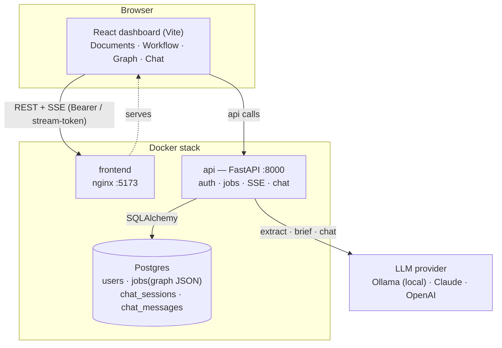
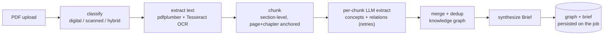
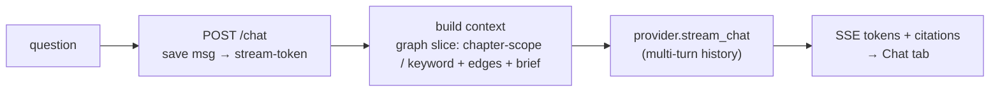

# KnowledgeBook — Document Knowledge Graph

Turn a long technical document (e.g. a 350-page PDF like *The Pragmatic
Programmer*) into a **navigable knowledge graph** of concepts and relationships,
so a reader can understand the book fast without reading it end to end.

> Not summarization — a *semantic map*. The goal: state the thesis in one
> sentence, name the 5–10 core concepts, see how they connect, and know which
> chapter to jump to for any of them.

---

## Why

A 300-page book holds ~15–20 genuinely novel ideas buried in hundreds of pages of
elaboration. Reading it all is slow; skimming misses nuance. KnowledgeBook
ingests the PDF (digital **or scanned** — OCR built in), extracts concepts and
their relationships with an LLM, and produces four outputs: a **Brief**, a
**Concept Map**, a **Chapter Guide**, and grounded **Q&A**.

---

## Architecture

The stack is three containers — a **React dashboard**, a **FastAPI** service, and
**Postgres** — plus a pluggable **LLM provider** (local Ollama by default; Claude
or OpenAI via `.env`). Auth is JWT (access token in memory + HttpOnly refresh
cookie); jobs and chats are per-user with RBAC (admin / analyst / viewer).



**Ingestion pipeline** (background job, streamed live over SSE):



**Chat** (grounded on the stored graph, streamed token-by-token):



> Grounding is **graph-only** today (no embeddings/RAG) — see
> [`docs/FEATURE-document-chat.md`](docs/FEATURE-document-chat.md) for the
> upgrade path to hybrid retrieval.

---

## Repository layout

| Path | What it is |
|---|---|
| `docs/` | Product + engineering docs, each paired with a self-contained `*.ctx.md` AI digest |
| `extraction-service/` | The Dockerized ingestion → knowledge-graph service + HTTP API (runnable) |
| `frontend/` | React (Vite) **live workflow dashboard** — upload a PDF, watch each stage run, explore the graph |
| `spike/` | Week-1 PDF-parsing + OCR de-risking harness (reproducible) |
| `data/` | Input PDFs (local; not committed) |

### Documents (`docs/`)
The planning chain, each as `*.md` + `*.ctx.md` (read the `.ctx.md` alone if you
are another agent — it's self-contained):

| Doc | Purpose |
|---|---|
| `PRD-knowledge-graph-mvp.md` | Product requirements — scope (OCR is a Phase-1 must), the 4 outputs, acceptance criteria, success metrics |
| `SPIKE-week1-pdf-ocr.md` | Plan to retire the OCR/parser risk before building |
| `SPIKE-week1-findings.md` | Spike results so far (digital path measured on D1) |
| `ARCHITECTURE-mvp.md` | System design — async pipeline, data model, ADRs |
| `PLAN-phase1-implementation.md` | ~11-week, 2-engineer sprint plan with gates |
| `01-product-spec.md` | Auth + UI uplift spec (RBAC, login, app shell) |
| `FEATURE-document-chat.md` | Chat with a document, grounded in its knowledge graph |

---

## The service (`extraction-service/`)

```
PDF → classify (digital/scanned/hybrid) → extract text (pdfplumber + Tesseract OCR fallback)
    → chunk (section-level, page + chapter anchored) → per-chunk LLM concept/relation extraction
    → merge + conservative dedup → graph.json  (+ brief.md)
```

Every node/edge carries `source_refs` (chapter + page range) and a `confidence`
score; edges are explicit-only (no inferred/hallucinated relationships in MVP).

**Quick start (Docker, local LLM — no API key):**
```bash
ollama pull llama3.1            # install Ollama (https://ollama.com), pull a model
cd extraction-service
cp .env.example .env            # default provider = ollama (offline, no key)
mkdir -p out
docker compose run --rm extractor          # processes ../data/the-pragmatic-programmer.pdf
```
Outputs land in `extraction-service/out/`. See `extraction-service/README.md` for
local-run and provider-switching details.

**LLM provider** is `.env`-driven (`ollama | claude | openai`). It **defaults to a
local Ollama model** (offline, no API key) so you can try it immediately; switch
to **`claude-opus-4-8`** (official Anthropic SDK) for best quality. The
multi-provider abstraction and the OCR text extractor are reused from the sibling
`toeic_app/extraction-service`.

## The dashboard (`frontend/`)

A React (Vite) page that drives the service and **shows the full workflow live** —
upload a PDF, watch each stage (classify → OCR → chunk → extract → merge → brief)
update in real time via Server-Sent Events, then explore the concept graph
(`react-force-graph-2d`) and the Brief. Stack mirrors `toeic_app/frontend`.

```bash
# 1. API
cd extraction-service && uvicorn app.api:app --port 8000        # or: docker compose up api
# 2. Dashboard
cd frontend && cp .env.example .env && npm install && npm run dev   # http://localhost:5173
```

---

## Status

| Area | State |
|---|---|
| Product/engineering docs | Complete (PRD → Spike → Architecture → Plan) |
| Spike — digital PDF path | Measured on *The Pragmatic Programmer*: PyMuPDF extraction, 8/8 chapters detected; scanned-corpus + OCR cost still pending |
| Extraction service | Built; dependency-free logic unit-tested; **not yet run end-to-end** (needs deps + `ANTHROPIC_API_KEY`) |

### Open decisions (tracked in the PRD)
1. Acceptable hallucination rate + how to detect it
2. OCR vendor + per-document cost (blocked on the spike)
3. Raw-document storage vs. process-and-discard (privacy)

---

## Conventions
- Every phase doc is paired with a `*.ctx.md` AI digest; keep them in sync.
- Work is done inline (not via subagents) for these phase docs.
- Deliverables are written to an external-review quality bar: measurable
  acceptance criteria, explicit assumptions, traceability decision → requirement
  → metric, internal consistency across paired docs.

---

## License

Released under the **MIT License** — see [`LICENSE`](LICENSE).

```
MIT License

Copyright (c) 2026 KnowledgeBook

Permission is hereby granted, free of charge, to any person obtaining a copy
of this software and associated documentation files (the "Software"), to deal
in the Software without restriction, including without limitation the rights
to use, copy, modify, merge, publish, distribute, sublicense, and/or sell
copies of the Software, and to permit persons to whom the Software is
furnished to do so, subject to the following conditions:

The above copyright notice and this permission notice shall be included in all
copies or substantial portions of the Software.

THE SOFTWARE IS PROVIDED "AS IS", WITHOUT WARRANTY OF ANY KIND, EXPRESS OR
IMPLIED, INCLUDING BUT NOT LIMITED TO THE WARRANTIES OF MERCHANTABILITY,
FITNESS FOR A PARTICULAR PURPOSE AND NONINFRINGEMENT. IN NO EVENT SHALL THE
AUTHORS OR COPYRIGHT HOLDERS BE LIABLE FOR ANY CLAIM, DAMAGES OR OTHER
LIABILITY, WHETHER IN AN ACTION OF CONTRACT, TORT OR OTHERWISE, ARISING FROM,
OUT OF OR IN CONNECTION WITH THE SOFTWARE OR THE USE OR OTHER DEALINGS IN THE
SOFTWARE.
```
