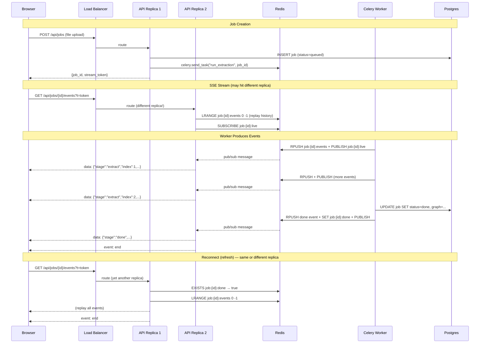
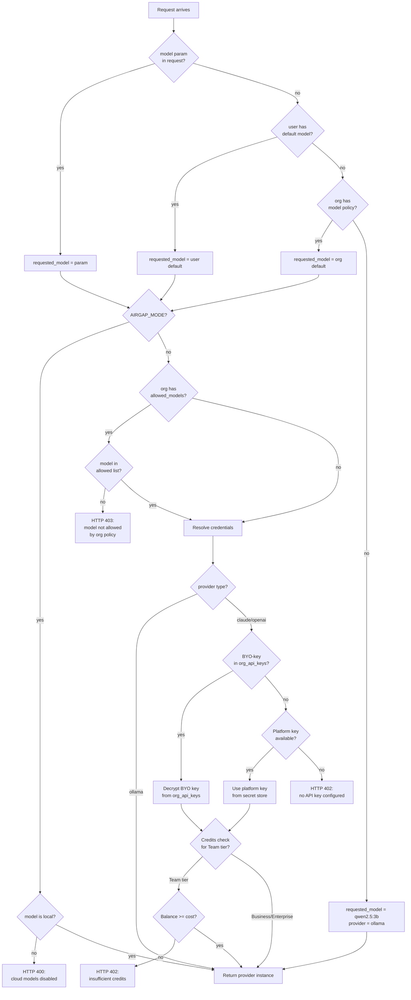

# Architecture: Enterprise Productization — KnowledgeBook

| | |
|---|---|
| **Document** | Enterprise Architecture & Migration Design |
| **Version** | 1.0 |
| **Date** | 2026-07-02 |
| **Status** | DESIGN — for engineering review |
| **Owner** | Engineering / Architecture |
| **Sources** | `ENTERPRISE-productization.md`, `ARCHITECTURE-mvp.md`, as-built source code |

> **Scope:** Design the migration from a single-process FastAPI app to an enterprise-ready, horizontally-scalable system. Covers EF-01/02/03/05/06/07/12/27/28 and D6/D14. This document is a design, not production code.

---

## 1. Current Architecture (As-Built Baseline)

Understanding exactly what exists is the prerequisite for any safe migration.

```
┌─────────────────────────────────────────────────────────┐
│              docker compose (single host)                │
│                                                          │
│  ┌──────────┐   ┌──────────────────────────────────────┐│
│  │ frontend │   │ api (uvicorn, single process)        ││
│  │ (nginx)  │──►│                                      ││
│  │ :5173    │   │  FastAPI app                         ││
│  └──────────┘   │  ├─ LIVE dict (in-memory SSE state)  ││
│                 │  ├─ threading.Thread (daemon jobs)   ││
│                 │  ├─ threading.Condition (pub/sub)    ││
│                 │  ├─ sync SQLAlchemy (psycopg2)       ││
│                 │  └─ LLM providers (ollama/claude/oa) ││
│                 └───────────────┬──────────────────────┘│
│                                 │                        │
│                 ┌───────────────▼──────────────────────┐│
│                 │ db (postgres:16-alpine)              ││
│                 │  users, jobs, document_files,         ││
│                 │  chat_sessions, chat_messages,        ││
│                 │  refresh_tokens                       ││
│                 └─────────────────────────────────────┘│
└─────────────────────────────────────────────────────────┘
```

**Key characteristics that constrain the migration:**

| Aspect | As-Built | Problem |
|--------|----------|---------|
| Job execution | `threading.Thread(daemon=True)` in the API process | Server restart kills running jobs; no retry; no scale-out |
| SSE (job progress) | In-memory `LIVE` dict with `threading.Condition` | Only the process that started the job has the events; multi-replica impossible |
| SSE (chat tokens) | `provider.stream_chat()` generator runs inside the SSE response generator | Tied to the request thread; works single-process; no cross-replica issue today but no persistence |
| Config | `.env` file re-read on every `get_settings()` call | Changing provider/model requires container restart |
| Auth | JWT (HS256) + HttpOnly refresh cookie; stream-token JWT in `?t=` | Functional; HS256 is acceptable for single-secret deployments |
| DB | Sync SQLAlchemy, single engine, `pool_pre_ping=True` | Functional; sync is fine for the migration (see ADR-E4) |
| Multi-tenancy | None; `user_id` ownership only | No `org_id` anywhere |
| Secrets | Raw `.env` file | Not production-grade |

---

## 2. Target Architecture

```mermaid
graph TB
    subgraph "Client"
        Browser["Browser (React)"]
    end

    subgraph "Load Balancer"
        LB["nginx / ALB<br/>TLS termination<br/>rate limiting (EF-02)"]
    end

    subgraph "API Fleet (stateless, N replicas)"
        API1["api-1<br/>FastAPI + uvicorn"]
        API2["api-2<br/>FastAPI + uvicorn"]
        APIn["api-N"]
    end

    subgraph "Redis (single instance, later Sentinel)"
        PubSub["Pub/Sub channels<br/>job:{id} / chat:{msg_id}<br/>config:invalidate"]
        Cache["Cache<br/>model_catalog / org_policies<br/>rate-limit counters"]
        Broker["Celery broker<br/>queues: extraction, chat-bg"]
    end

    subgraph "Worker Fleet (Celery)"
        W1["worker-1<br/>extraction tasks"]
        W2["worker-2<br/>extraction tasks"]
        Wn["worker-N"]
    end

    subgraph "Postgres 16"
        DB["users, orgs, jobs,<br/>document_files,<br/>chat_sessions, chat_messages,<br/>categories, category_permissions,<br/>model_catalog, org_model_policies,<br/>org_api_keys, credit_ledger,<br/>refresh_tokens"]
    end

    subgraph "Secret Store"
        Vault["Vault / AWS SM / K8s Secrets<br/>JWT_SECRET, platform API keys,<br/>DB encryption key"]
    end

    subgraph "LLM Providers"
        Ollama["Ollama (local)"]
        Claude["Claude API"]
        OpenAI["OpenAI API"]
    end

    Browser --> LB
    LB --> API1 & API2 & APIn

    API1 & API2 & APIn -->|subscribe| PubSub
    API1 & API2 & APIn -->|read cache| Cache
    API1 & API2 & APIn -->|queries| DB
    API1 & API2 & APIn -->|chat stream<br/>direct to provider| Claude & OpenAI & Ollama

    W1 & W2 & Wn -->|consume tasks| Broker
    W1 & W2 & Wn -->|publish events| PubSub
    W1 & W2 & Wn -->|persist state| DB
    W1 & W2 & Wn -->|LLM calls| Claude & OpenAI & Ollama

    API1 & API2 & APIn --> Vault
    W1 & W2 & Wn --> Vault
```



### Component Registry

| Component | Responsibility | Technology | New or Existing |
|-----------|---------------|-----------|-----------------|
| **Load Balancer** | TLS termination, rate limiting (EF-02), round-robin | nginx (or ALB) | New |
| **API Fleet** | Stateless HTTP + SSE endpoints; subscribes to Redis pub/sub for event streaming; config cache reads | FastAPI + uvicorn (unchanged) | Existing, modified |
| **Celery Workers** | Execute extraction jobs + retry-failed; publish progress events to Redis; persist results to Postgres | Celery 5.x + Redis broker | New (replaces daemon threads) |
| **Redis** | Celery broker; pub/sub channels for SSE fan-out; config/policy cache; rate-limit counters | Redis 7 (single instance, Sentinel for HA later) | New |
| **Postgres** | Source of truth for all state: users, orgs, jobs, documents, chat, config, credits | PostgreSQL 16 (existing) | Existing, schema extended |
| **Secret Store** | Platform API keys, JWT signing key, DB encryption key | Vault / AWS SM / K8s Secrets (deploy-specific) | New |
| **LLM Providers** | Extraction + chat completions | ollama / claude / openai (existing factory) | Existing, extended with credential resolution |

---

## 3. The Hard Problems — Detailed Design

### 3.1 Streaming Across a Stateless, Multi-Replica API

This is the hardest problem. Today, the SSE generator and the job execution thread share the same process memory (`LIVE` dict + `threading.Condition`). With Celery workers and multiple API replicas, the event producer and the SSE consumer are in different processes on different hosts.

#### Design: Redis Pub/Sub + Redis List for History

**Architecture:**
- **Event history:** Redis List (`job:{job_id}:events`) — append-only, ordered, survives reconnects.
- **Live notification:** Redis Pub/Sub channel (`job:{job_id}:live`) — ephemeral signal that a new event was appended.
- **Terminal signal:** A special event `{"stage": "done", ...}` in the list, plus a Redis key `job:{job_id}:done` (SET with TTL) as a fast "is this job finished?" check.
- **TTL cleanup:** Event lists expire 1 hour after job completion (configurable). Postgres `job.events` column remains the permanent record.

**Worker publishes events (replaces `on_event` callback):**

```python
# In the Celery task (worker process)
def publish_event(job_id: str, event: dict, redis: Redis):
    """Append to history list + notify all subscribers."""
    serialized = json.dumps(event)
    pipe = redis.pipeline()
    pipe.rpush(f"job:{job_id}:events", serialized)
    pipe.publish(f"job:{job_id}:live", serialized)
    if event.get("stage") == "done":
        pipe.set(f"job:{job_id}:done", "1", ex=3600)
    pipe.execute()
```

**API replica subscribes and streams to client (replaces `LIVE` dict):**

```python
# In the SSE endpoint (any API replica)
async def stream_events_gen(job_id: str, redis: Redis):
    # 1. Check if job is already done (fast path for finished jobs)
    if redis.exists(f"job:{job_id}:done"):
        # Replay all events from the list, then end
        for raw in redis.lrange(f"job:{job_id}:events", 0, -1):
            yield f"data: {raw.decode()}\n\n"
        yield "event: end\ndata: {}\n\n"
        return

    # 2. If list doesn't exist in Redis (old job, pre-migration),
    #    fall back to Postgres events column
    if not redis.exists(f"job:{job_id}:events"):
        with session_scope() as db:
            job = db.get(Job, job_id)
            for ev in (job.events or []):
                yield f"data: {json.dumps(ev)}\n\n"
            yield "event: end\ndata: {}\n\n"
            return

    # 3. Live job: replay history, then follow pub/sub
    pubsub = redis.pubsub()
    pubsub.subscribe(f"job:{job_id}:live")
    try:
        # Replay everything already in the list
        idx = 0
        existing = redis.lrange(f"job:{job_id}:events", 0, -1)
        for raw in existing:
            yield f"data: {raw.decode()}\n\n"
            ev = json.loads(raw)
            if ev.get("stage") == "done":
                yield "event: end\ndata: {}\n\n"
                return
        idx = len(existing)

        # Follow live events via pub/sub
        while True:
            msg = pubsub.get_message(timeout=15.0)
            if msg and msg["type"] == "message":
                yield f"data: {msg['data'].decode()}\n\n"
                ev = json.loads(msg['data'])
                if ev.get("stage") == "done":
                    yield "event: end\ndata: {}\n\n"
                    return
            else:
                # Heartbeat to keep connection alive
                yield ": heartbeat\n\n"
    finally:
        pubsub.unsubscribe()
        pubsub.close()
```

**Reconnect after refresh:**
- Client reconnects SSE (browser refresh, network blip).
- The new SSE connection hits any API replica.
- That replica reads the full Redis List (`LRANGE 0 -1`) — replays all events emitted so far.
- If the job is still running, it subscribes to the pub/sub channel and follows live events.
- If the job finished while disconnected, the done key is set, so replay + end.
- **Race condition mitigation:** Between LRANGE and SUBSCRIBE, new events could arrive. Solution: after subscribing, do a second LRANGE for items after `idx` to catch the gap. This is a standard Redis pattern.

**Chat token streaming — different pattern:**

Chat streaming is fundamentally different from job progress. The LLM stream is consumed synchronously by the response generator — the API process calls `provider.stream_chat()` and yields tokens directly. This works fine with multiple API replicas because:
- The chat SSE request is self-contained: it carries the stream-token, loads context from Postgres, calls the LLM, streams back.
- There is no worker involved; the LLM call happens in the API process.
- No cross-replica coordination needed.

**Why keep chat streaming in-process instead of moving to a worker:**
- Chat streams are short-lived (seconds, not minutes).
- Moving to a worker adds latency (task dispatch + pub/sub hop) for no benefit.
- The LLM provider's streaming iterator is designed for synchronous consumption.
- Rate limiting + enforcement happen at the API layer before the stream starts.

**The only change needed for chat streaming:** None for the streaming itself. The enforcement middleware (Section 3.5) wraps the route. If we later want chat-in-background (e.g., for very long completions), the pub/sub pattern from job streaming applies identically.

#### Sequence Diagram: Job Progress SSE Across Replicas



---

### 3.2 Job Lifecycle with Celery + Redis

**Decision:** Celery + Redis broker (D6). Justification in ADR-E1 below.

#### Queue Topology

| Queue | Purpose | Worker Concurrency | Notes |
|-------|---------|-------------------|-------|
| `extraction` | Full document extraction jobs (`run_extraction`) | 2 per worker (CPU-bound OCR + LLM-bound) | Default queue; most jobs land here |
| `extraction` | Retry-failed-chunks (`retry_failed_chunks`) | Same pool | Reuses same queue; lower priority via task routing if needed |

**Why one queue, not many:** At current scale (single-digit concurrent jobs), a single `extraction` queue is sufficient. Adding queues (e.g., `ocr`, `llm`, `summarize`) is premature — it complicates worker configuration without benefit until we have distinct scaling needs per stage. The pipeline runs as one Celery task that progresses through stages internally, publishing events at each transition.

#### Celery Task Design

```python
@celery_app.task(bind=True, max_retries=2, default_retry_delay=30,
                 acks_late=True, reject_on_worker_lost=True)
def run_extraction(self, job_id: str):
    """Run the full extraction pipeline for a job.

    - acks_late: task is acknowledged AFTER completion, so if the worker
      crashes mid-job, the task is redelivered to another worker.
    - reject_on_worker_lost: if the worker process dies (OOM, kill),
      the task goes back to the queue instead of being lost.
    """
    redis = get_redis()

    def on_event(ev: dict):
        publish_event(job_id, ev, redis)

    with session_scope() as db:
        job = db.get(Job, job_id)
        if not job or job.status != "queued":
            return  # idempotency: already processed or cancelled
        job.status = "running"
        db.commit()
        data = db.get(DocumentFile, job_id).data
        title = job.title

    try:
        # Resolve LLM provider via config-as-data (Section 3.3)
        provider = resolve_provider(job)
        graph = run_pipeline(data, title, provider, cfg, on_event=on_event)
        with session_scope() as db:
            job = db.get(Job, job_id)
            job.status = "done"
            job.graph = graph
            job.events = [json.loads(e) for e in
                          redis.lrange(f"job:{job_id}:events", 0, -1)]
    except Exception as exc:
        with session_scope() as db:
            job = db.get(Job, job_id)
            job.status = "error"
            job.error = str(exc)
        on_event({"stage": "done", "status": "error", "detail": str(exc)})
        # Celery retry on transient failures (LLM timeout, DB glitch)
        if self.request.retries < self.max_retries:
            raise self.retry(exc=exc)
    finally:
        on_event({"stage": "done", "status": job.status})
        redis.set(f"job:{job_id}:done", "1", ex=3600)
```

#### Job State Transitions

```
                        ┌──────────────────────────────┐
  POST /api/jobs ──►    │  QUEUED (persisted in DB)     │
                        └──────────┬───────────────────┘
                                   │ Celery picks up task
                        ┌──────────▼───────────────────┐
                        │  RUNNING (worker executing)   │
                        └──────────┬───────────────────┘
                             ┌─────┴─────┐
                      success│           │failure
                    ┌────────▼──┐  ┌─────▼───────────┐
                    │   DONE    │  │   ERROR          │
                    └───────────┘  └─────┬───────────┘
                                         │ POST /retry-failed
                                  ┌──────▼───────────┐
                                  │  QUEUED (retry)   │──► RUNNING ──► DONE|ERROR
                                  └──────────────────┘
```

**Postgres is the source of truth** for job status. Redis holds ephemeral event history for SSE streaming. On job completion, events are also persisted to `job.events` in Postgres (the permanent record).

#### Retries and Idempotency

- **Celery-level retry:** `max_retries=2` with `acks_late=True`. If a worker crashes, the task is redelivered. The task checks `job.status != "queued"` at the start to avoid double-processing (idempotency guard).
- **Chunk-level retry:** The existing `chunk_retries=2` (per-chunk LLM call retry) is preserved inside the pipeline. This handles transient LLM errors without restarting the whole job.
- **`retry-failed-chunks`:** The existing POST `/api/jobs/{id}/retry-failed` endpoint dispatches a Celery task instead of starting a daemon thread. Same idempotency: checks for failed_chunks in the graph.

#### Cost Cap

The existing per-document cost ledger (AD-8 from MVP architecture) is preserved. The cost cap check runs inside the pipeline loop. If exceeded, the pipeline raises `CostCapExceeded`, which the Celery task catches and records as `status=error, error="cost_cap"`.

#### LLM Host Dependency / Timeouts

- LLM calls use the provider SDK's built-in retry (e.g., Anthropic SDK `max_retries=3`).
- Per-call timeout: 120s for `complete_json` (extraction), 30s for `stream_chat` (chat tokens). Configured in provider constructors.
- If the LLM host is completely down, the chunk fails and is added to `failed_chunks`. The job continues with remaining chunks (graceful degradation, per MVP architecture).
- Worker heartbeat: Celery `worker_task_soft_time_limit=900` (15 min) to catch stuck jobs. `worker_task_time_limit=960` (16 min) hard kill.

---

### 3.3 Config-as-Data (D14 / EF-28)

**Problem:** Today, LLM provider/model is read from `.env` at boot. Changing the model requires a container restart. EF-28 requires per-user model selection resolved at request time.

#### Resolution Precedence

```
Request `model` param
    │
    ▼ (if not provided)
User's default model (user_settings table)
    │
    ▼ (if not set)
Org default model (org_model_policies.default_extraction_model / default_chat_model)
    │
    ▼ (if no org or no policy)
System default: free-local (qwen2.5:3b via Ollama)
    │
    ▼ Validate against org_model_policies.allowed_models[]
    │ (if org exists and policy restricts)
    ▼ Resolve credentials
        ├─ BYO-key: decrypt from org_api_keys (AES-256-GCM, key from secret store)
        ├─ Platform key: from secret store (Team tier credits)
        └─ Local (Ollama): no key needed
```

#### Config Resolution Flow



#### Cache + Pub/Sub Invalidation

```python
# Cache layer (thin wrapper around Redis)
MODEL_CATALOG_KEY = "config:model_catalog"
ORG_POLICY_KEY = "config:org_policy:{org_id}"
INVALIDATION_CHANNEL = "config:invalidate"
CACHE_TTL = 60  # seconds (30-60s per D14)

def get_model_catalog(redis: Redis, db: Session) -> list[dict]:
    """Read model catalog from cache; fill from DB on miss."""
    cached = redis.get(MODEL_CATALOG_KEY)
    if cached:
        return json.loads(cached)
    rows = db.execute(select(ModelCatalog)).scalars().all()
    catalog = [r.to_dict() for r in rows]
    redis.setex(MODEL_CATALOG_KEY, CACHE_TTL, json.dumps(catalog))
    return catalog

def get_org_policy(redis: Redis, db: Session, org_id: str) -> dict | None:
    """Read org model policy from cache; fill from DB on miss."""
    key = ORG_POLICY_KEY.format(org_id=org_id)
    cached = redis.get(key)
    if cached:
        return json.loads(cached)
    row = db.scalar(select(OrgModelPolicy).where(OrgModelPolicy.org_id == org_id))
    if not row:
        return None
    policy = row.to_dict()
    redis.setex(key, CACHE_TTL, json.dumps(policy))
    return policy

# Admin writes (e.g., POST /api/orgs/{id}/model-policy)
def invalidate_config(redis: Redis, keys: list[str]):
    """Delete cached keys + publish invalidation signal."""
    pipe = redis.pipeline()
    for key in keys:
        pipe.delete(key)
    pipe.publish(INVALIDATION_CHANNEL, json.dumps({"keys": keys}))
    pipe.execute()
```

**Fleet-wide propagation:** Every API replica runs a background thread that subscribes to `config:invalidate`. When it receives a message, it deletes the listed keys from its local in-process cache (if any). Since the primary cache is Redis (shared), invalidation is immediate for all replicas. The pub/sub channel handles the edge case where a replica has an in-process LRU cache on top of Redis.

**Propagation latency:** < 1 second (Redis pub/sub is near-instantaneous). The 60s TTL is the fallback if a pub/sub message is missed (e.g., replica was restarting during the publish).

---

### 3.4 Multi-Tenancy Foundation (EF-12)

**Goal:** Introduce `org_id` across existing tables with minimal disruption. Coexist with per-user ownership and category ACLs.

#### Least-Disruptive Path: Nullable `org_id` + Request-Scoped Tenant Context

**Step 1: Add `org_id` as nullable FK to existing tables.**

New tables:
```sql
-- Migration V__add_orgs.sql
CREATE TABLE orgs (
    id VARCHAR(32) PRIMARY KEY,
    name VARCHAR(255) NOT NULL UNIQUE,
    tier VARCHAR(16) NOT NULL DEFAULT 'team',  -- team|business|enterprise
    is_active BOOLEAN NOT NULL DEFAULT TRUE,
    created_at TIMESTAMPTZ NOT NULL DEFAULT now(),
    updated_at TIMESTAMPTZ NOT NULL DEFAULT now()
);

ALTER TABLE users ADD COLUMN org_id VARCHAR(32) REFERENCES orgs(id);
CREATE INDEX idx_users_org_id ON users(org_id);

ALTER TABLE jobs ADD COLUMN org_id VARCHAR(32) REFERENCES orgs(id);
CREATE INDEX idx_jobs_org_id ON jobs(org_id);

ALTER TABLE chat_sessions ADD COLUMN org_id VARCHAR(32) REFERENCES orgs(id);
```

**Why nullable, not NOT NULL:**
- Existing data has no org. A NOT NULL migration requires backfilling all rows, which means creating a "default" org and assigning everyone to it. This is invasive and changes the semantics of existing single-user deployments and on-prem installs.
- Nullable `org_id` means: `NULL` = "no org" (personal use, on-prem single-tenant, legacy data). Non-null = "belongs to this org."
- On-prem / air-gapped deployments may never use orgs. Forcing an org on them is wrong.

**Step 2: Request-scoped tenant context.**

```python
# app/tenant.py — request-scoped tenant context
from dataclasses import dataclass
from typing import Optional

@dataclass
class TenantContext:
    user_id: str
    user_role: str
    org_id: Optional[str]  # None for personal / on-prem / legacy
    org_tier: Optional[str]  # team|business|enterprise|None

def get_tenant(user: User = Depends(get_current_user)) -> TenantContext:
    """FastAPI dependency: extracts tenant context from the authenticated user."""
    return TenantContext(
        user_id=user.id,
        user_role=user.role,
        org_id=user.org_id,
        org_tier=user.org.tier if user.org_id and user.org else None,
    )
```

**Step 3: Row-level scoping — the `tenant_filter` dependency.**

```python
# app/tenant.py (continued)
def tenant_filter(query, model_class, tenant: TenantContext):
    """Apply consistent tenant scoping to any query.
    
    Rules:
    - If user has an org_id: filter by org_id (sees all org data, subject to role/ACL).
    - If user has no org_id: filter by user_id (personal data only).
    - Admin role: sees all within their org (or all if no org — superadmin).
    """
    if tenant.org_id:
        return query.where(model_class.org_id == tenant.org_id)
    elif tenant.user_role == "admin":
        return query  # superadmin (no org) sees everything
    else:
        return query.where(model_class.user_id == tenant.user_id)
```

**This is applied consistently** via the enforcement middleware (Section 3.5), not per-route. No route can forget it.

**Backfill strategy:** Existing data gets `org_id = NULL`. When a user is invited to an org, their `user.org_id` is set, and their existing jobs' `org_id` is backfilled via a one-time admin action (not automatic — prevents accidental data sharing).

---

### 3.5 Enforcement Architecture (EF-27 + EF-28 + Tenancy)

**Problem:** Authorization checks (tenant scope, category ACL, model policy, credits) must be applied uniformly to every job/chat/pdf route. If any route forgets a check, it is a security hole. Ad-hoc `Depends()` per route is fragile.

#### Design: Layered FastAPI Dependencies (Composition, Not Middleware)

The enforcement layer is a **composable dependency chain**, not a global middleware. Global middleware cannot access route parameters (like `job_id`) or make authorization decisions that depend on the resource. FastAPI's dependency injection is the right tool.

```
Request
  │
  ▼
get_current_user(Authorization header)          ← existing
  │
  ▼
get_tenant(user) → TenantContext                ← new (Section 3.4)
  │
  ▼
require_role("admin", "analyst")                ← existing (optional, per-route)
  │
  ▼
enforce_job_access(job_id, tenant, db)           ← new: combines all checks
  ├── tenant_filter (org scoping)
  ├── require_category_grant(job.category_id, min_grant, tenant)  ← EF-27
  └── (for mutations) enforce_model_policy(tenant, model)          ← EF-28
  │
  ▼
Route handler (only reached if all checks pass)
```

```python
# app/enforcement.py — single file, single responsibility

def enforce_job_access(
    job_id: str,
    tenant: TenantContext = Depends(get_tenant),
    db: Session = Depends(get_db),
    min_grant: str = "view",  # view|upload|manage
) -> Job:
    """The ONE place that checks: does this user have access to this job?
    
    Checks (in order):
    1. Job exists
    2. Tenant scope (org_id match or user_id match)
    3. Category grant (EF-27) — if job has a category_id
    4. Returns the job if all pass; raises HTTPException otherwise
    """
    job = db.get(Job, job_id)
    if not job:
        raise HTTPException(404, "job not found")
    
    # Tenant scope
    if tenant.org_id:
        if job.org_id != tenant.org_id:
            raise HTTPException(404, "job not found")  # 404, not 403 (don't leak existence)
    else:
        if job.user_id != tenant.user_id and tenant.user_role != "admin":
            raise HTTPException(404, "job not found")
    
    # Category ACL (EF-27) — skip if no category (pre-migration data)
    if job.category_id and tenant.user_role != "admin":
        grant = db.scalar(
            select(CategoryPermission.grant_type)
            .where(CategoryPermission.category_id == job.category_id,
                   CategoryPermission.subject_type == "user",
                   CategoryPermission.subject_id == tenant.user_id)
        )
        grant_hierarchy = {"view": 1, "upload": 2, "manage": 3}
        if not grant or grant_hierarchy.get(grant, 0) < grant_hierarchy.get(min_grant, 0):
            raise HTTPException(403, "insufficient category permission")
    
    return job


def enforce_model_policy(
    tenant: TenantContext,
    requested_model: str | None,
    operation: str,  # "extraction" | "chat"
    db: Session,
    redis: Redis,
) -> tuple[LlmProvider, str]:
    """Resolve and enforce model selection (EF-28 + D14).
    
    Returns (provider_instance, resolved_model_name).
    Raises HTTPException on policy violation or insufficient credits.
    """
    # ... config-as-data resolution from Section 3.3 ...
    pass
```

**Every job-scoped route uses `enforce_job_access`:**

```python
# Before (fragile — each route does its own check):
@app.get("/api/jobs/{job_id}")
def get_job(job_id: str, user = Depends(get_current_user), db = Depends(get_db)):
    job = _owned_job(job_id, user, db)  # hand-rolled, easy to forget

# After (uniform — enforcement is the dependency):
@app.get("/api/jobs/{job_id}")
def get_job(job: Job = Depends(enforce_job_access)):  # cannot forget
    return job.detail()
```

**Why not a global middleware?**
- Middleware runs before route resolution — it doesn't know `job_id`, `category_id`, etc.
- Middleware can't return the loaded `Job` object to the route handler (avoiding a second DB query).
- FastAPI dependencies compose cleanly, are testable, and are explicit about what each route requires.
- A route that doesn't need job access (e.g., `GET /api/models`) simply doesn't depend on `enforce_job_access`.

**Hard-to-bypass guarantee:** The key property is that `enforce_job_access` *returns the Job*. If a route needs the Job object, it must go through enforcement to get it. There is no other way to obtain a Job in the route handler. This is the same pattern as `get_current_user` returning the `User` — you can't get the user without authentication.

---

## 4. Rate Limiting (EF-02)

**Approach:** `slowapi` (built on `limits` library) with Redis backend.

| Endpoint Group | Limit | Scope | Rationale |
|---------------|-------|-------|-----------|
| `POST /api/jobs` (upload) | 5/hour per user | `user_id` | LLM cost control; extraction is expensive |
| `POST /api/jobs/{id}/chat` | 10/minute per user | `user_id` | Chat is cheaper but still LLM-bound |
| `POST /api/auth/login` | 10/minute per IP | IP | Brute-force protection |
| `POST /api/auth/register` | 5/hour per IP | IP | Abuse prevention |
| All other endpoints | 60/minute per user | `user_id` | General protection |

**Implementation:** `slowapi` middleware with Redis storage. The Redis instance is the same one used for Celery broker and pub/sub (single Redis, multiple logical uses).

```python
from slowapi import Limiter
from slowapi.util import get_remote_address

limiter = Limiter(
    key_func=lambda request: request.state.user_id if hasattr(request.state, 'user_id')
                             else get_remote_address(request),
    storage_uri=f"redis://{REDIS_HOST}:{REDIS_PORT}/1",  # DB 1 for rate limits
)
```

**Nginx-level rate limiting (defense in depth):** Add `limit_req_zone` in nginx for DDoS protection before requests even reach FastAPI. This catches unauthenticated floods that `slowapi` (which requires user identification) cannot.

---

## 5. Secrets Management (EF-05)

**Current state:** All secrets (JWT_SECRET, ANTHROPIC_API_KEY, ADMIN_PASSWORD, DATABASE_URL) live in `.env` files mounted into containers.

**Target state (tiered by deployment mode):**

| Secret | SaaS (cloud) | On-Prem / Air-Gapped |
|--------|-------------|---------------------|
| JWT_SECRET | AWS Secrets Manager / Vault | K8s Secret or mounted file |
| Platform API keys (Anthropic, OpenAI) | AWS SM / Vault | N/A (air-gapped) |
| DB encryption key (for BYO-key encryption) | AWS KMS / Vault Transit | K8s Secret |
| DATABASE_URL | AWS SM / env (private network) | K8s Secret or env |
| ADMIN_PASSWORD (bootstrap) | AWS SM | K8s Secret |

**BYO-key encryption (EF-28):**
- User-provided API keys (stored in `org_api_keys`) are encrypted with AES-256-GCM before writing to Postgres.
- The encryption key lives in the secret store (never in the DB, never in `.env`).
- `key_hint` (last 4 chars) stored in plaintext for UI display ("sk-...a1b2").
- Key validation: before storing, make a lightweight API call (e.g., `GET /models` for OpenAI) to verify the key works.

**Migration path:** Introduce a `SecretProvider` interface with two implementations: `EnvSecretProvider` (reads from env, backward-compatible) and `VaultSecretProvider` (reads from Vault/AWS SM). Toggle via `SECRET_PROVIDER=env|vault`. This way existing docker-compose deployments keep working while cloud deployments use proper secret management.

---

## 6. Observability Seams (EF-07)

**Current state:** `audit()` function writes JSON lines to stderr. No metrics, no tracing.

**Target seams (add instrumentation points, not full observability stack):**

| Concern | Instrumentation Point | Tool |
|---------|----------------------|------|
| **Structured logging** | Replace `audit()` with `structlog` + JSON formatter; add `trace_id`, `org_id`, `user_id` to every log line | `structlog` |
| **Metrics** | `/metrics` endpoint (Prometheus format); counters: `jobs_total`, `jobs_failed`, `chat_messages_total`; histograms: `job_duration_seconds`, `llm_call_duration_seconds`, `chat_ttft_seconds` | `prometheus-fastapi-instrumentator` |
| **Health check** | `GET /api/health` extended: check DB connectivity, Redis connectivity, Celery worker heartbeat | Existing endpoint, extended |
| **Error alerting** | Unhandled exceptions → Sentry (or structured log + alert rule) | `sentry-sdk[fastapi]` |
| **Tracing** | OpenTelemetry auto-instrumentation for FastAPI + SQLAlchemy + Redis + HTTP client | `opentelemetry-instrumentation-fastapi` (deferred to P1; seams only now) |

**"Seams only" means:** Add the structlog calls and Prometheus counters now. The aggregation/alerting infrastructure (Grafana, PagerDuty) is deployed separately and is not part of the code migration.

---

## 7. Backups (EF-06)

| What | Strategy | RPO | Retention |
|------|----------|-----|-----------|
| **Postgres** | `pg_dump` daily (cron in sidecar or host) + WAL archiving to object store for PITR | < 24h (daily dump) or < 5 min (WAL) | 30 days |
| **Redis** | Not backed up — ephemeral (cache + pub/sub). Loss = brief SSE interruption + cache refill. Job state is in Postgres. | N/A | N/A |
| **Document files** | Stored in Postgres (`document_files` table). Backed up with the DB. Consider migrating to S3/MinIO later for cost. | Same as Postgres | Same |

**Restore testing:** Monthly automated restore to a test instance + verify connectivity (script in CI or cron).

---

## 8. Architecture Decision Records (ADRs)

### ADR-E1: Celery + Redis for Job Queue (vs. alternatives)

| Option | Pros | Cons |
|--------|------|------|
| **Celery + Redis** | Mature, battle-tested; Redis already needed for pub/sub + cache; `acks_late` + `reject_on_worker_lost` for crash recovery; rich retry/routing | Celery can be complex to debug; Redis as broker lacks some guarantees vs. RabbitMQ |
| arq (async, Redis-based) | Lightweight; native async | Small community; no `acks_late` equivalent; less mature monitoring |
| Dramatiq + Redis | Simpler API than Celery; Redis-backed | Smaller ecosystem; fewer production battle scars |
| RQ (Redis Queue) | Very simple | No retry, no `acks_late`, no task routing; too basic |
| PostgreSQL-based (e.g., procrastinate, pgqueues) | No Redis dependency | Polling-based (latency); DB load; no pub/sub for SSE |

**Decision:** Celery + Redis. **Decisive factor:** Redis is already required for EF-03 (stateless SSE) and D14 (config cache). Adding Celery on top of the same Redis is zero additional infrastructure. Celery's `acks_late` + `reject_on_worker_lost` provide the crash recovery guarantee that the current daemon threads lack. The ecosystem (Flower for monitoring, Celery Beat for scheduling) is mature.

**Trade-off accepted:** Celery's complexity (signal handling, prefork vs. eventlet, canvas) is overkill for our current simple use case. We mitigate by keeping the task design simple (one task per job type, no chaining/chords).

### ADR-E2: Redis Pub/Sub + List for SSE (vs. Redis Streams)

| Option | Pros | Cons |
|--------|------|------|
| **Redis Pub/Sub + List** | Simple; pub/sub is fire-and-forget (perfect for SSE notification); List provides ordered history for replay; well-understood pattern | Pub/sub messages are lost if no subscriber is listening (OK — history is in the List); no consumer groups |
| Redis Streams (XADD/XREAD) | Built-in history + consumer groups; `$` for "only new" | More complex API; consumer groups are overkill (we don't need exactly-once delivery to SSE clients); XREAD blocking requires careful connection management; higher Redis memory per stream |
| Server-Sent Events via PostgreSQL LISTEN/NOTIFY | No Redis dependency for SSE | Payload limit (8KB); no built-in history; connection pooling complications; doesn't scale to many concurrent listeners |

**Decision:** Redis Pub/Sub + List. **Decisive factor:** The history/replay requirement is cleanly separated (List = history, pub/sub = notification). This maps exactly to the existing `LIVE` dict pattern (append-only list + condition variable notification). Redis Streams add complexity (consumer groups, stream trimming, XACK) that solves a problem we don't have — SSE clients don't need exactly-once delivery, and we don't need to track which events each client has consumed (the client replays from the beginning on reconnect).

**Trade-off accepted:** Pub/sub messages are lost if no API replica is subscribed at the moment of publish. This is fine because the List is the source of truth for replay. The pub/sub is purely a "wake up and check the list" signal.

### ADR-E3: Keep Sync SQLAlchemy (vs. Async)

| Option | Pros | Cons |
|--------|------|------|
| **Keep sync SQLAlchemy (psycopg2)** | Zero migration effort; well-tested; Celery workers are sync (prefork); FastAPI handles sync deps fine via threadpool | Blocks a thread per DB call in the API (mitigated by uvicorn threadpool) |
| Migrate to async SQLAlchemy (asyncpg) | Non-blocking DB calls; better under high concurrency | Large migration (every `db.get()`, `db.scalar()`, `session_scope()` must become `await`; every route must become `async def`; Celery workers stay sync anyway) |

**Decision:** Keep sync SQLAlchemy. **Decisive factor:** The migration effort is high and the benefit is low at current scale. FastAPI runs sync dependencies in a threadpool automatically. The real concurrency bottleneck is LLM calls (seconds), not DB calls (milliseconds). Celery workers are sync by nature (prefork model). Migrating to async would require touching every route, every dependency, every DB call, and every Celery task — a big-bang rewrite that violates our incremental migration principle.

**Revisit trigger:** If API replicas exceed 4 and DB connection pool becomes a bottleneck (monitor `hikari_connections_active` equivalent, i.e., SQLAlchemy pool `checkedout` metric).

### ADR-E4: Tenant Scoping via Dependency Injection (vs. PostgreSQL RLS)

| Option | Pros | Cons |
|--------|------|------|
| **FastAPI dependency (tenant_filter)** | Explicit; testable; works with existing sync SQLAlchemy; no DB-level complexity; easy to reason about | Must be applied consistently (mitigated by enforcement layer design) |
| PostgreSQL Row-Level Security (RLS) | Enforcement at DB level — impossible to bypass from application code | Requires `SET app.current_org_id` per connection; incompatible with connection pooling without `pgbouncer` in transaction mode; debugging is opaque; harder to test; doesn't compose with category ACL (which is application logic) |
| SQLAlchemy event hooks (`do_orm_execute`) | Automatic query rewriting | Magic — hard to debug; doesn't work for all query patterns; risky with complex joins |

**Decision:** FastAPI dependency injection. **Decisive factor:** The enforcement layer design (Section 3.5) makes bypass nearly impossible — you can't get a `Job` object without going through `enforce_job_access`, which includes tenant filtering. PostgreSQL RLS is the "correct" database-level solution but introduces operational complexity (connection-level state, pooling issues) that is not justified at our current scale and team size.

**Trade-off accepted:** Tenant isolation is enforced at the application level, not the database level. A bug in the enforcement layer could leak data across tenants. Mitigation: the enforcement code is < 50 lines, in one file, and every code review of a new route checks that it uses `enforce_job_access`.

---

## 9. Migration Sequence — Incremental, Low-Risk

The migration is ordered so that **each step is independently deployable** and **the system works throughout**. No big-bang.

### Migration Order

```
Step 1: Add Redis                          (infrastructure only, no code change)
Step 2: Celery worker + job queue          (EF-01: replaces daemon threads)
Step 3: SSE via Redis pub/sub              (EF-03: replaces LIVE dict)
Step 4: Rate limiting                      (EF-02: add slowapi)
Step 5: Secrets management                 (EF-05: SecretProvider interface)
Step 6: Observability seams                (EF-07: structlog + prometheus)
Step 7: Multi-tenancy foundation           (EF-12: add org_id, nullable)
Step 8: Config-as-data                     (D14/EF-28: model catalog + resolution)
Step 9: Category ACL                       (EF-27: categories + grants)
Step 10: Enforcement layer                 (unify all auth checks)
Step 11: Multi-replica API                 (EF-17: scale API horizontally)
```

### Detailed Step Descriptions

#### Step 1: Add Redis (1 day)
- Add `redis:7-alpine` to `docker-compose.yml`.
- Add `REDIS_URL` to settings.
- No code changes to the API. Redis is running but unused.
- **Backward compatible:** Yes. Existing single-process still works.

#### Step 2: Celery Worker + Job Queue (1-2 weeks) — EF-01
- Add `celery` + `redis` (Python) to `requirements.txt`.
- Create `app/celery_app.py` with Celery configuration.
- Create `app/tasks.py` with `run_extraction` and `retry_failed_chunks` tasks.
- Move `_run_job` and `_retry_job` logic from `api.py` into Celery tasks.
- Change `POST /api/jobs` to: save job with `status=queued`, dispatch Celery task, return immediately.
- Change `POST /api/jobs/{id}/retry-failed` similarly.
- Add `worker` service to `docker-compose.yml`.
- **The `LIVE` dict still works** for SSE during this step — the Celery task runs in a separate process, so it writes events to Redis List AND still calls `on_event` to write to LIVE if the API process is the same host (or skips LIVE if not). SSE still reads from LIVE if available, falls back to Postgres.
- **Actually, simpler approach:** In Step 2, the Celery task publishes events ONLY to Redis List + pub/sub. SSE reads from Redis. The `LIVE` dict is removed. This means Step 2 and Step 3 are done together.

**Revised: Steps 2+3 are a single deployment unit.**

#### Steps 2+3: Celery + Stateless SSE (2-3 weeks) — EF-01 + EF-03
- All job execution moves to Celery workers.
- All SSE streaming reads from Redis (pub/sub + List).
- The `LIVE` dict, `threading.Condition`, and `threading.Thread` are removed from `api.py`.
- Chat streaming remains in-process (no change).
- **Test:** Start 2 API replicas. Create a job via replica 1. Open SSE via replica 2. Verify events stream correctly. Refresh browser. Verify replay works.
- **Rollback:** Revert to single-process + daemon threads (the old code is in git).

#### Step 4: Rate Limiting (2-3 days) — EF-02
- Add `slowapi` to requirements.
- Configure limits per endpoint group (Section 4).
- Uses the existing Redis instance.
- **Backward compatible:** Yes. Adds constraints, doesn't change behavior.

#### Step 5: Secrets Management (3-5 days) — EF-05
- Create `SecretProvider` interface + `EnvSecretProvider` + `VaultSecretProvider`.
- Refactor `get_settings()` to read secrets via the provider.
- Default to `EnvSecretProvider` (no behavior change for existing deployments).
- **Backward compatible:** Yes. Existing `.env` deployments unchanged.

#### Step 6: Observability Seams (3-5 days) — EF-07
- Replace `audit()` with `structlog`.
- Add `prometheus-fastapi-instrumentator`.
- Extend `/api/health` with Redis + DB checks.
- **Backward compatible:** Yes. Adds instrumentation, doesn't change behavior.

#### Step 7: Multi-Tenancy Foundation (1-2 weeks) — EF-12
- Alembic migration: add `orgs` table, add nullable `org_id` to `users`, `jobs`, `chat_sessions`.
- Add `TenantContext` dependency.
- Add `tenant_filter` helper.
- Do NOT change existing routes yet — tenant filtering is opt-in at this step.
- **Backward compatible:** Yes. All existing data has `org_id = NULL`. No behavior change.

#### Step 8: Config-as-Data (2-3 weeks) — D14 / EF-28
- Alembic migration: add `model_catalog`, `org_model_policies`, `org_api_keys`, `user_settings` tables.
- Implement `resolve_provider()` with the precedence chain (Section 3.3).
- Add cache + pub/sub invalidation.
- Add `GET /api/models`, `POST /api/orgs/{id}/model-policy`, `POST/DELETE /api/orgs/{id}/api-keys` endpoints.
- Modify `POST /api/jobs` and `POST /api/jobs/{id}/chat` to accept optional `model` param.
- Seed `model_catalog` with the existing models (qwen2.5:3b, claude-3-5-sonnet, gpt-4o, etc.).
- **Backward compatible:** Yes. Without a `model` param, the existing precedence falls through to the system default (which is the current `.env`-driven behavior). `get_settings()` still works as the bottom of the precedence chain.

#### Step 9: Category ACL (1-2 weeks) — EF-27
- Alembic migration: add `categories`, `category_permissions` tables. Add `category_id` (nullable FK) to `jobs`.
- Backfill: create "General" category, assign all existing jobs, grant existing users `upload` on General.
- Implement `require_category_grant()` dependency.
- **Backward compatible:** Yes. Existing jobs get "General" category with permissive grants. No access change for existing users.

#### Step 10: Enforcement Layer (1 week)
- Create `app/enforcement.py` with `enforce_job_access`.
- Refactor all job-scoped routes to use `enforce_job_access` as the dependency (replacing `_owned_job`).
- Add `enforce_model_policy` integration to job creation and chat.
- **This is the step where all the pieces connect.** Tenant scoping + category ACL + model policy enforcement are unified.
- **Backward compatible:** Yes. The enforcement layer implements the same logic as the existing `_owned_job` checks, plus the new tenant/category/model checks (which are no-ops for users without orgs/categories).

#### Step 11: Multi-Replica API (1-2 days)
- At this point, the API is stateless. Scale by adding replicas.
- Update `docker-compose.yml` with `deploy.replicas: 2` (or use a proper orchestrator).
- Add nginx upstream configuration for load balancing.
- **Backward compatible:** Yes.

### Migration Timeline Summary

| Step | Duration | Dependencies | What Still Works During Migration |
|------|----------|-------------|-----------------------------------|
| 1. Add Redis | 1 day | None | Everything (Redis unused) |
| 2+3. Celery + SSE | 2-3 weeks | Step 1 | Job creation, chat, auth — all functional. SSE reconnect works. |
| 4. Rate limiting | 2-3 days | Step 1 | Everything + rate limits active |
| 5. Secrets | 3-5 days | None (parallel with 4) | Everything |
| 6. Observability | 3-5 days | None (parallel with 4-5) | Everything + metrics |
| 7. Multi-tenancy | 1-2 weeks | Step 2+3 | Everything. Nullable org_id = no behavior change |
| 8. Config-as-data | 2-3 weeks | Steps 5, 7 | Everything. Falls through to env defaults |
| 9. Category ACL | 1-2 weeks | Step 7 | Everything. "General" category = no access change |
| 10. Enforcement | 1 week | Steps 7, 8, 9 | Everything. Same checks, unified |
| 11. Multi-replica | 1-2 days | Steps 2+3 | Everything at scale |

**Total:** ~10-14 weeks for the full migration. Steps 4/5/6 can run in parallel with each other and with step 7.

---

## 10. Data Model Changes (Summary)

### New Tables

| Table | Purpose | Key Columns |
|-------|---------|-------------|
| `orgs` | Organization / tenant | `id`, `name`, `tier`, `is_active` |
| `categories` | Document categories (deal rooms) | `id`, `org_id` (nullable), `name`, `created_by` |
| `category_permissions` | Per-category ACL grants | `category_id`, `subject_type`, `subject_id`, `grant_type` |
| `model_catalog` | Available LLM models | `id`, `provider`, `model_id`, `label`, `tier`, `credit_cost`, `is_local` |
| `org_model_policies` | Per-org model restrictions | `org_id`, `allowed_models[]`, `default_extraction_model`, `default_chat_model`, `require_byo_key` |
| `org_api_keys` | BYO API keys (encrypted) | `org_id`, `provider`, `encrypted_key`, `key_hint` |
| `user_settings` | Per-user preferences | `user_id`, `default_extraction_model`, `default_chat_model` |
| `credit_ledger` | Credit transactions (Team tier) | `org_id`, `user_id`, `amount`, `credit_type`, `model_used`, `job_id` |

### Modified Tables

| Table | Change |
|-------|--------|
| `users` | Add `org_id VARCHAR(32) REFERENCES orgs(id)` (nullable) |
| `jobs` | Add `org_id` (nullable), `category_id` (nullable FK), `extraction_model`, `llm_provider` |
| `chat_sessions` | Add `org_id` (nullable) |

---

## 11. Risks and Open Questions

### Risks

| Risk | Impact | Mitigation |
|------|--------|-----------|
| **Redis SPOF** | Redis failure = no SSE, no job dispatch, no cache | Redis Sentinel for HA (Phase 1); Redis data is ephemeral — Postgres is source of truth; API degrades gracefully (chat still works, jobs queue when Redis returns) |
| **Celery task stuck** | Job hangs indefinitely | `soft_time_limit=900` + `time_limit=960`; Flower monitoring; health check includes worker heartbeat |
| **Race condition: pub/sub gap** | Events published between LRANGE and SUBSCRIBE are missed by SSE | After subscribing, do a second LRANGE for items after the last index seen; standard Redis pattern |
| **BYO-key security** | Encrypted keys in DB; if DB is compromised, encryption key in secret store is the last defense | AES-256-GCM; encryption key in Vault/KMS (never in DB); audit log on key access; key_hint only in UI |
| **Migration data loss** | Backfill scripts corrupt existing data | Every migration is backward-compatible; nullable columns; backfill in separate migration; test on production copy first |
| **Config cache staleness** | Admin changes model policy but old policy served from cache | Pub/sub invalidation (< 1s); 60s TTL fallback; admin UI shows "change propagating..." indicator |

### Open Questions

| # | Question | Owner | Needed By |
|---|----------|-------|-----------|
| AQ-1 | Redis deployment: single instance vs. Sentinel vs. Cluster for P0? | Infra | Before Step 1 |
| AQ-2 | Alembic vs. Flyway for migration management? (Currently using `Base.metadata.create_all`) | Engineering | Before Step 7 |
| AQ-3 | Credit ledger: reserve-then-deduct (pre-authorization) vs. check-then-deduct (optimistic)? | Product | Before Step 8 |
| AQ-4 | On-prem: should `org_id` be auto-created for single-tenant on-prem installs? | Product | Before Step 7 |
| AQ-5 | Chat streaming: should chat messages also persist to Redis List for cross-replica replay (currently not needed — chat stream runs in-process)? | Engineering | Before Step 11 |
| AQ-6 | SSE reconnect: should the client send `Last-Event-ID` header, and should we use it to skip already-delivered events? | Frontend | Before Step 3 |

---

## 12. Target docker-compose.yml (Post-Migration)

```yaml
services:
  db:
    image: postgres:16-alpine
    environment:
      POSTGRES_USER: kb
      POSTGRES_PASSWORD: kb
      POSTGRES_DB: kb
    volumes:
      - kb_pgdata:/var/lib/postgresql/data
    healthcheck:
      test: ["CMD-SHELL", "pg_isready -U kb"]
      interval: 5s
      timeout: 3s
      retries: 10

  redis:
    image: redis:7-alpine
    command: redis-server --appendonly yes --maxmemory 256mb --maxmemory-policy allkeys-lru
    volumes:
      - kb_redis:/data
    healthcheck:
      test: ["CMD", "redis-cli", "ping"]
      interval: 5s
      timeout: 3s
      retries: 5

  api:
    build: .
    entrypoint: ["uvicorn", "app.api:app", "--host", "0.0.0.0", "--port", "8000"]
    env_file: .env
    environment:
      DATABASE_URL: postgresql+psycopg2://kb:kb@db:5432/kb
      REDIS_URL: redis://redis:6379/0
    depends_on:
      db: { condition: service_healthy }
      redis: { condition: service_healthy }
    deploy:
      replicas: 2

  worker:
    build: .
    entrypoint: ["celery", "-A", "app.celery_app", "worker",
                 "--loglevel=info", "--concurrency=2",
                 "-Q", "extraction"]
    env_file: .env
    environment:
      DATABASE_URL: postgresql+psycopg2://kb:kb@db:5432/kb
      REDIS_URL: redis://redis:6379/0
    depends_on:
      db: { condition: service_healthy }
      redis: { condition: service_healthy }

  nginx:
    image: nginx:alpine
    ports:
      - "443:443"
      - "80:80"
    volumes:
      - ./nginx.conf:/etc/nginx/nginx.conf:ro
    depends_on:
      - api

  frontend:
    build:
      context: ../frontend
      args:
        VITE_API_URL: ""  # relative, proxied through nginx
    depends_on:
      - nginx

volumes:
  kb_pgdata:
  kb_redis:
```

---

*End of Architecture v1.0.*
